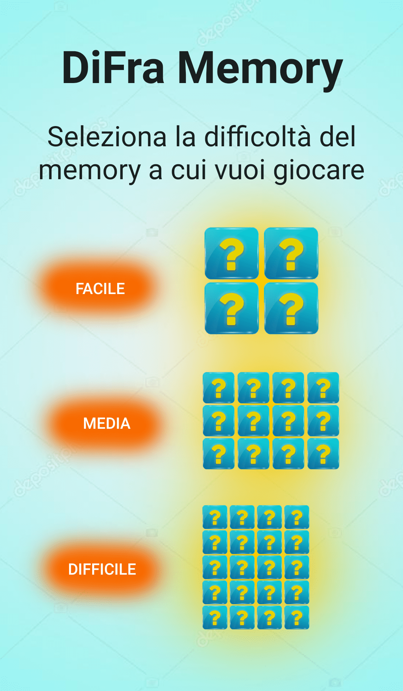
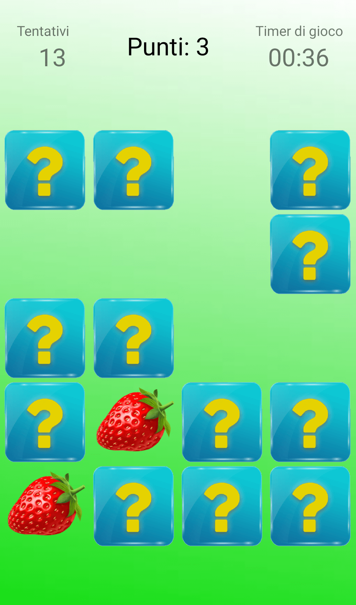
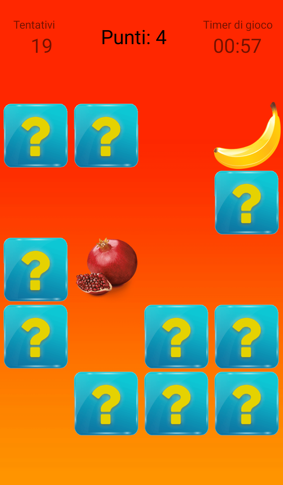
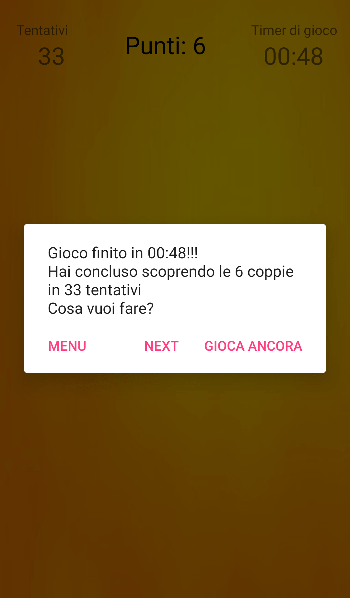

# DiFra Memory
DiFra Memory is a game created in Android Studio.  
The application has 3 main levels: easy, medium and hard where all the tiles are shuffled when a new game is opened.  
The game has the numbers of the attemps, the score and timer.  
When a game is over the app asks you if you want to play again.

## How to play
Easy way: download the signed apk in the [repository releases](https://github.com/MarcoDiFrancesco/DiFraMemory/releases/latest).

Hard way: add the repository to visual studio code and compile the application from there, then test it in a emulator.

## Screenshot → Main screen

  

## Screenshots → Hard mode

